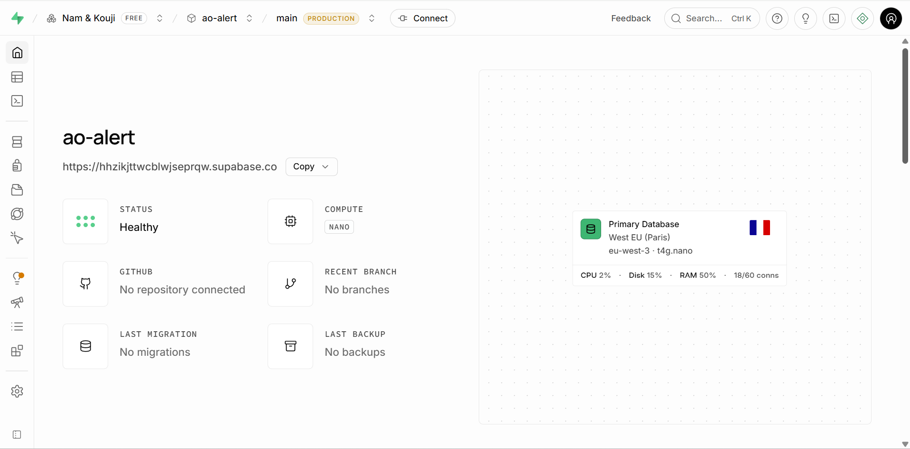
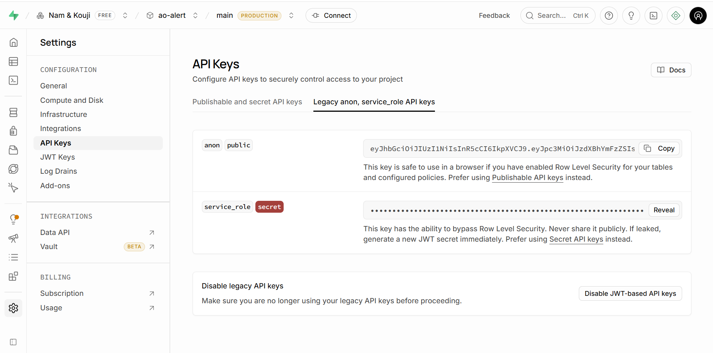
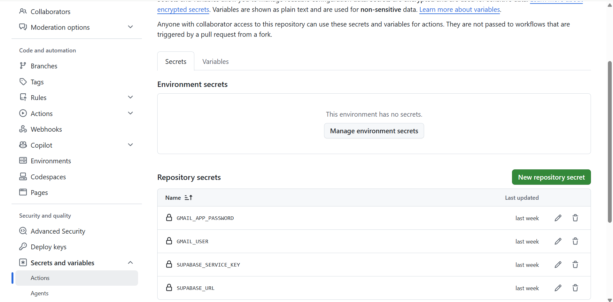
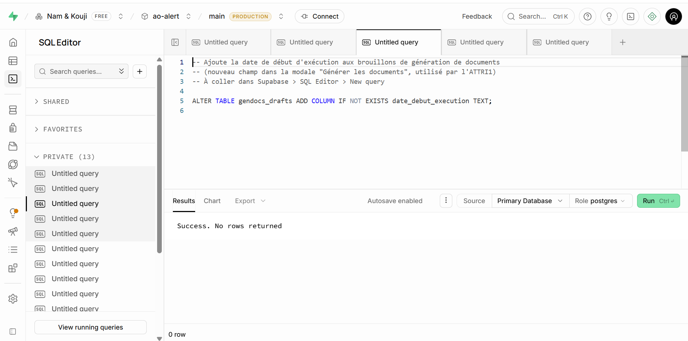
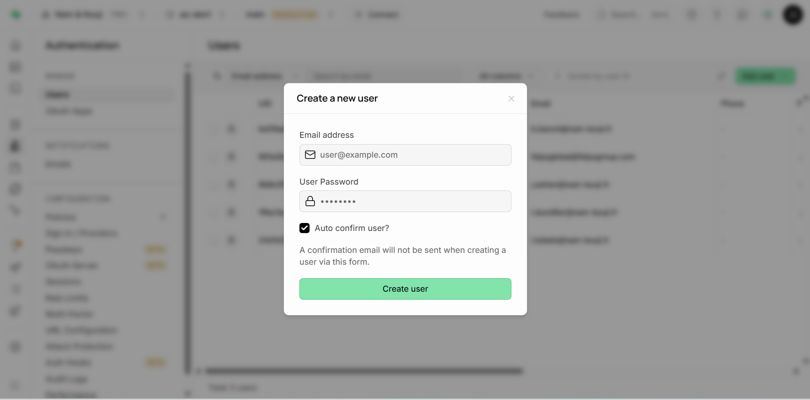
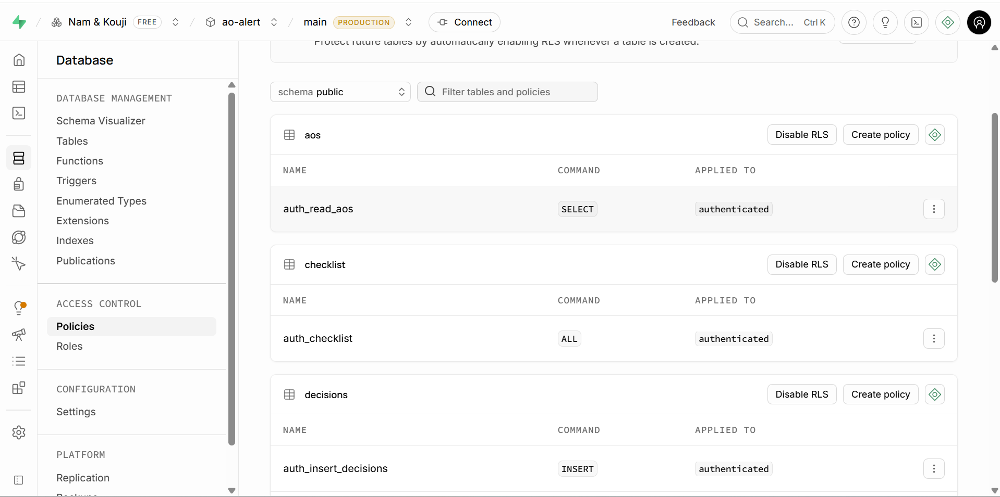
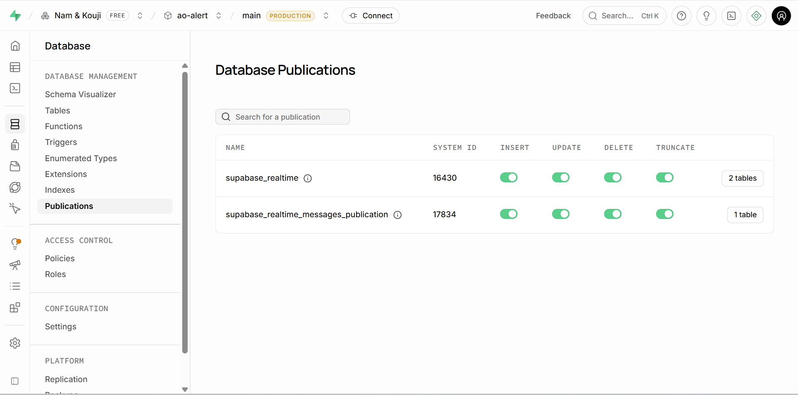

# AO Alert RSE/TEE/RH

Outil de veille automatisée des appels d'offres publics en lien avec la **RSE**, la
**transition écologique (TEE)** et les **ressources humaines (RH)**, à destination des
consultants de **Nam & Kouji**. Chaque jour, un scan interroge 15 sources publiques, filtre et
note les AOs pertinentes, puis les publie dans un tableau de bord web et un email récapitulatif.

**App en production :** https://ao-alert-rse.github.io/ao-alert-rse/

---

## Reprendre ce projet avec Claude Code

Ce projet a été développé et maintenu avec [Claude Code](https://claude.com/claude-code),
l'assistant de développement en ligne de commande d'Anthropic. Si vous reprenez ce projet sans
expertise technique poussée, voici comment vous appuyer dessus efficacement plutôt que de partir
de zéro.

**Importer ce projet — option A, Claude Code Desktop (le plus simple, sans ligne de commande)**
1. Télécharger et installer l'application Claude Code Desktop (Mac/Windows) depuis
   https://claude.com/claude-code, puis se connecter avec un compte Anthropic.
2. Télécharger une copie du projet, sans rien installer d'autre : aller sur
   https://github.com/ao-alert-rse/ao-alert-rse, cliquer sur le bouton vert **Code**, puis
   **Download ZIP**. Dézipper le dossier obtenu là où vous voulez sur votre ordinateur (clic droit
   sur le fichier `.zip` > *Extraire tout*).
   *Aucun compte GitHub à connecter à Claude pour cette étape — c'est un simple téléchargement.
   Relier GitHub ne devient utile que plus tard, si vous voulez que Claude renvoie ses
   modifications sur GitHub directement (git push) ; le moment venu, demandez-lui de vous guider
   pas à pas, il vous dira exactement quoi faire.*
3. Ouvrir Claude Code Desktop, et depuis l'écran d'accueil ouvrir le dossier dézippé à l'étape 2
   comme projet.
4. Facultatif, seulement si vous voulez que Claude puisse réellement lancer un scan ou
   prévisualiser l'application en local (pas nécessaire pour discuter du code ou faire des
   modifications simples) : dans le dossier du projet, dupliquer le fichier `.env.example`,
   renommer la copie en `.env`, l'ouvrir avec le Bloc-notes et remplir les 4 valeurs :
   - `SUPABASE_URL` et `SUPABASE_SERVICE_KEY` : voir
     [où les trouver](#où-trouver-les-clés-api) dans le Guide Supabase ci-dessous.
   - `GMAIL_USER` et `GMAIL_APP_PASSWORD` : à demander à la personne qui vous transmet l'accès au
     compte Google du projet.
5. Dès la toute première session, demander explicitement à Claude de lire `CLAUDE.md` et ce
   `README.md` en entier avant de faire quoi que ce soit — ils contiennent tout le contexte
   nécessaire (architecture, règles de travail du repo, historique des bugs déjà corrigés).

**Importer ce projet — option B, Claude Code en terminal (pour les plus à l'aise avec la ligne de commande)**
1. Cloner ce repo sur la machine où Claude Code est installé :
   `git clone https://github.com/ao-alert-rse/ao-alert-rse.git`
2. Ouvrir un terminal **dans le dossier cloné** (`cd ao-alert-rse`), puis lancer `claude` — Claude
   Code utilise automatiquement le dossier courant comme projet, rien d'autre à configurer.
3. Mêmes étapes 4-5 que l'option A ci-dessus (`.env`, puis demander à Claude de lire `CLAUDE.md`
   et ce README).

**Donner le bon contexte à chaque session :** Claude ne se souvient pas automatiquement d'une
session à l'autre. Au début de chaque nouvelle session sur un sujet important, expliquez
brièvement ce que vous voulez faire, et si besoin pointez vers la section du README concernée
(ex. « regarde la section Guide Supabase avant de toucher aux utilisateurs »).

**Exemples de demandes courantes à lui donner :**
- *« Vérifie que le scan automatique tourne bien tous les jours »* — Claude peut consulter
  l'historique des runs GitHub Actions et diagnostiquer un éventuel blocage.
- *« Le scraper de [source] ne remonte plus rien, regarde ce qui a changé sur le site »* —
  diagnostic puis correctif, sur le modèle de ce qui a déjà été fait plusieurs fois (voir
  l'historique des commits).
- *« Ajoute une nouvelle source de veille : [url du site] »* — Claude peut créer un nouveau
  fichier dans `scrapers/` sur le modèle des scrapers existants.
- *« Une AO affiche une date/un montant qui semble faux »* — signal à prendre au sérieux et à
  faire vérifier en direct contre la source plutôt que de laisser filer (voir la fragilité
  documentée dans [Limitations connues](#limitations-connues-et-chantiers-en-cours)).

**Accès à fournir pour qu'il puisse réellement agir :**
- Ce repo cloné en local.
- Le fichier `.env` rempli si des tests de scan en local sont nécessaires (voir
  [Installation](#installation--développement-local)).
- Pas d'accès Supabase à donner directement à Claude pour la gestion des comptes utilisateurs —
  ça reste un geste humain volontaire (voir
  [Authentification et gestion des utilisateurs](#authentification-et-gestion-des-utilisateurs)).

**Règles de travail déjà en place à respecter (détaillées dans `CLAUDE.md`) :**
- Toujours `git fetch && git status` avant de commencer — le scan automatique peut avoir poussé
  sur `main` entre-temps.
- Ne jamais laisser traîner de modifications locales sur les fichiers générés par le scan
  (`data/ao-history.json`, `data/scan-log.json`, `rapport.html`) — les committer ou les annuler
  tout de suite.
- Ne committer que ce qui a été explicitement validé dans la session en cours.

---

## Sommaire

- [Reprendre ce projet avec Claude Code](#reprendre-ce-projet-avec-claude-code)
- [Vue d'ensemble](#vue-densemble)
- [Fonctionnement du scan quotidien](#fonctionnement-du-scan-quotidien)
- [Sources surveillées](#sources-surveillées)
- [Scoring RSE/TEE/RH](#scoring-rsetéerh)
- [Déduplication](#déduplication)
- [Application web](#application-web)
- [Génération des documents de candidature](#génération-des-documents-de-candidature)
- [Architecture technique](#architecture-technique)
- [Structure du repo](#structure-du-repo)
- [Guide Supabase — administrer le projet](#guide-supabase--administrer-le-projet)
- [Installation / développement local](#installation--développement-local)
- [Déploiement](#déploiement)
- [Limitations connues et chantiers en cours](#limitations-connues-et-chantiers-en-cours)

---

## Vue d'ensemble

Le problème de départ : les appels d'offres publics liés à la RSE, la transition écologique et
les RH sont dispersés sur une quinzaine de plateformes (BOAMP, TED, sites d'OPCO, places de
marché régionales...), publiés en continu, et noyés au milieu de milliers d'AOs hors sujet
(travaux, fournitures, informatique...). Repérer à la main les AOs pertinentes chaque jour n'est
pas tenable.

AO Alert automatise ce travail :

1. **Scanne** 15 sources chaque matin (GitHub Actions, cron quotidien).
2. **Filtre et note** chaque AO trouvée selon un système de score à deux axes (thème RSE/TEE/RH
   + verbe d'action de conseil), pour ne garder que les vraies missions de conseil/accompagnement
   et écarter les faux positifs (marchés de travaux ou fournitures citant incidemment un critère
   RSE).
3. **Déduplique** les AOs qui apparaissent sur plusieurs sources à la fois (un même avis publié
   à la fois sur BOAMP et TED, par exemple).
4. **Synchronise** le résultat vers une base Supabase, consommée par une application web.
5. **Notifie** l'équipe par email tous les lundis (AOs à score ≥ 35) et publie un rapport HTML
   statique à chaque scan.
6. Permet ensuite à l'équipe de **décider** (GO / NO GO / En cours / Répondu / Remporté / Perdu),
   suivre une **checklist** de procédure, et **générer automatiquement** les documents de
   candidature (DC1, DC2, ATTRI1) pré-remplis.

## Fonctionnement du scan quotidien

```
┌─────────────────────────────────────────────────────────────┐
│  GitHub Actions — cron quotidien (01h00 UTC)                 │
│  .github/workflows/ao-scan.yml                                │
└───────────────────────────┬───────────────────────────────────┘
                            │  node index.js
                            ▼
   ┌─────────────────────────────────────────────────────────┐
   │ 1. Scrape 15 sources en parallèle (scrapers/*.js)         │
   │    avec timeout et retry par source                       │
   └───────────────────────────┬─────────────────────────────┘
                                ▼
   ┌─────────────────────────────────────────────────────────┐
   │ 2. Filtrage : score RSE/TEE ≥ 20, hors zone/hors cible    │
   │    exclus, AOs déjà closes exclues (utils/filtrer.js)     │
   └───────────────────────────┬─────────────────────────────┘
                                ▼
   ┌─────────────────────────────────────────────────────────┐
   │ 3. Déduplication cross-source par ContractFolderID        │
   │    (utils/filtrer.js → dedupCrossSource)                  │
   └───────────────────────────┬─────────────────────────────┘
                                ▼
   ┌─────────────────────────────────────────────────────────┐
   │ 4. Détection des nouvelles AOs vs. historique local        │
   │    (utils/detector.js → data/ao-history.json)              │
   └───────────────────────────┬─────────────────────────────┘
                                ▼
        ┌───────────────────────┼───────────────────────┐
        ▼                       ▼                       ▼
┌───────────────┐   ┌─────────────────────┐   ┌─────────────────────┐
│ rapport.html   │   │ Sync Supabase        │   │ Email récapitulatif │
│ (reporter.js)  │   │ (supabase-sync.js)   │   │ (mailer.js, lundi)  │
└───────────────┘   └──────────┬──────────┘   └─────────────────────┘
                                ▼
                  ┌─────────────────────────────┐
                  │ Filets de sécurité post-sync  │
                  │ • dedup-reconcile.js          │
                  │   (fusionne les doublons       │
                  │   cross-source déjà en base)   │
                  │ • refresh-cloture.js          │
                  │   (revérifie les dates de      │
                  │   clôture jamais déterminées)  │
                  └─────────────────────────────┘
```

Le scan tourne aussi en local (`node index.js` / `npm run scan`) pour du debug, mais commiter
les fichiers générés (`data/ao-history.json`, `data/scan-log.json`, `rapport.html`) issus d'un
scan de test n'est pas souhaitable — voir [CLAUDE.md](CLAUDE.md).

En cas d'anomalie (0 AO toutes sources confondues, ou une source historiquement fiable qui tombe
soudainement à 0 — signe probable d'un scraper cassé par une refonte de site), un email d'alerte
dédié est envoyé (`utils/source-health.js` + `utils/mailer.js`).

## Sources surveillées

| Source | Type | Détail |
|---|---|---|
| **BOAMP — acheteurs ciblés** | API JSON (OpenDataSoft) | Requête par nom d'acheteur (OPCOs, régions, ADEME, Caisse des dépôts...) |
| **BOAMP — mots-clés** | API JSON (OpenDataSoft) | Recherche par ~60 mots-clés RSE/TEE/RH dans tout le champ `objet`, tout acheteur confondu |
| **TED/FR** | API JSON (TED v3) | Avis européens publiés en France, recherche par mots-clés dans le titre de lot |
| **OPCO ATLAS, 2i, OCAPIAT, OPCO EP, Uniformation, AKTO, Constructys, OPCO Mobilités** | Scraping HTML | Sites propres de chaque OPCO (pas de couverture BOAMP fiable pour tous) |
| **ADEME** | Scraping HTML | Site direct |
| **PLACE (marchés publics de l'État)** | Scraping HTML | Recherche par mot-clé, une requête par mot-clé |
| **Maximilien (Île-de-France)** | Scraping HTML | Recherche par mot-clé |
| **e-marchespublics.com** | Scraping HTML + endpoint JSON de pagination | Ajouté 07/07/2026 — chevauchement partiel avec BOAMP/TED mais couvre des AOs propres au site (petites communes) |

Deux sources évaluées et écartées : **marchesonline.com** (protection anti-bot au niveau de
l'empreinte réseau sur l'endpoint de recherche) et **francemarches.com** (protégé par
DataDome). Voir l'historique des commits pour le détail de l'investigation.

## Scoring RSE/TEE/RH

`utils/scorer.js` calcule un score de 0 à 100 sur **deux axes combinés** :

- **Axe thème** : le sujet de l'AO couvre un domaine RSE/ESG/Transition (RSE, bilan carbone,
  CSRD, QVCT, achats responsables, économie circulaire...). Mots-clés « forts » (+35 pts dans le
  titre) et « faibles » plus génériques (+20 pts).
- **Axe verbe** : l'AO cherche une prestation de **conseil/accompagnement/formation** (audit,
  diagnostic, AMO, formation, sensibilisation...) et non des travaux ou fournitures. +15 pts.
- **Bonus +15** si les deux axes sont présents à la fois — signal fort d'une mission de conseil
  RSE.
- Un score de 0 est retourné si aucun signal thématique n'est trouvé, quel que soit le verbe.

Seuils utilisés en aval :
- **Application** : score ≥ 20 pour être synchronisé vers Supabase (`utils/supabase-sync.js`).
- **Email récap (chaque lundi)** : score ≥ 35 pour être notifié (`utils/mailer.js`).

**Limite connue** : un mot-clé thème fort seul peut suffire à dépasser le seuil sans qu'aucun
verbe d'action ne soit présent, ce qui laisse passer occasionnellement de faux positifs (ex. un
marché de travaux mentionnant incidemment un critère RSE). Documenté, pas corrigé à ce stade pour
ne pas déséquilibrer le scoring existant sans tests plus approfondis.

Chaque AO reçoit aussi des **tags thématiques** (RSE, Carbone, CSRD, QVCT, Formation, Achats,
Éco-conception) dérivés des mots-clés qui ont matché, utilisés pour le filtrage dans
l'application.

## Déduplication

Une même consultation peut apparaître plusieurs fois : sur plusieurs sources à la fois (un avis
eForms publié simultanément sur BOAMP et TED), ou avec un titre légèrement différent d'un scan à
l'autre (republication BOAMP avec des lots réordonnés, par exemple).

- **En amont** (`utils/filtrer.js` → `dedupCrossSource`) : fusion par `ContractFolderID`, un
  identifiant standard eForms identique sur BOAMP et TED pour un même dossier de marché.
- **Clé d'upsert stable** (`computeAOKey` dans `utils/filtrer.js`) : basée sur l'identifiant
  natif de la plateforme (idweb BOAMP / numéro de publication TED extrait de l'URL), avec repli
  sur le titre normalisé si absent — volontairement **pas** basée sur un champ dont l'extraction
  dépend d'un appel réseau séparé pouvant échouer un jour sur deux.
- **Filet de sécurité en aval** (`utils/dedup-reconcile.js`) : tourne après chaque sync,
  regroupe automatiquement les lignes déjà en base partageant le même `ContractFolderID` et les
  fusionne (réaffecte décisions/checklist/documents vers la ligne avec le plus de travail réel
  dessus). Ne fusionne jamais automatiquement si plusieurs lignes ont déjà des données
  utilisateur dessus — dans ce cas, log et traitement manuel.

## Application web

Dashboard statique (`app.html`) servi par GitHub Pages, connecté en direct à Supabase
(authentification email/password, Realtime activé sur les tables `aos` et `decisions`).

- **Tableau filtrable** : par score, tags thématiques, recherche texte, tri sur toutes les
  colonnes (titre, source, score, date de clôture, montant estimatif).
- **KPIs** : montant du pipeline en cours, nombre de marchés remportés, AOs urgentes (clôture
  ≤ 10 jours), taux de succès.
- **Graphiques** (Chart.js) : AOs par mois, répartition par statut de décision.
- **Workflow de décision** en 6 statuts : À décider → **GO** / **NO GO** → En cours → Répondu →
  Remporté / Perdu. Chaque décision est horodatée et attribuée à son auteur.
- **Checklist de procédure** (5 étapes) sur les AOs passées en GO.
- **Upload de documents** (DCE) par AO, stocké dans Supabase Storage.
- **Fiche détail** au clic : description complète, score détaillé par mot-clé matché, lien
  source.
- **Export CSV** de la vue filtrée courante.
- **Multi-utilisateur** : Benjamin Baroni (admin), Lucas Toledo, John Adrien.
- Un onglet **NO GO** archive les AOs refusées, mais masque automatiquement celles déjà closes
  depuis longtemps pour ne garder que les refus encore d'actualité.

## Génération des documents de candidature

Depuis la fiche d'une AO passée en GO, génération automatique des documents de candidature
**DC1** (lettre de candidature), **DC2** (déclaration du candidat) et **ATTRI1** (acte
d'engagement, ex-DC3) :

- Templates DOCX dans `assets/templates/`, remplis côté navigateur avec
  [docxtemplater](https://docxtemplater.com/) + pizzip (chargés depuis le CDN jsDelivr en build
  ESM — le build `.min.js` classique est en CommonJS pur et inutilisable en `<script type=module>`
  direct).
- Données société fixes dans la constante `COMPANY` de `app.html` (SIRET, représentant légal,
  chiffre d'affaires, effectif, attestation RC Pro).
- Champs spécifiques au marché (objet, référence, montant de l'offre, délai d'exécution) saisis
  dans un brouillon persistant par AO (table `gendocs_drafts`).
- Documents générés uploadés automatiquement dans Supabase Storage (bucket `dce`) et référencés
  dans la table `documents`.
- Le **DUME** est explicitement hors scope.

## Architecture technique

- **Backend de scan** : Node.js (`>=18`), exécuté par GitHub Actions — pas de serveur permanent.
- **Scraping** : [node-fetch](https://www.npmjs.com/package/node-fetch) pour les API JSON
  (BOAMP, TED), [cheerio](https://cheerio.js.org/) pour le parsing HTML des sites sans API.
- **Base de données** : Supabase (Postgres + Auth + Storage + Realtime), plan gratuit.
- **Frontend** : HTML/JS vanilla, pas de framework ni de build — [Chart.js](https://www.chartjs.org/)
  v4 pour les graphiques, [@supabase/supabase-js](https://github.com/supabase/supabase-js) v2
  côté client.
- **Hébergement** : GitHub Pages, déploiement automatique à chaque push sur `main`.
- **Emails** : Gmail SMTP via [nodemailer](https://nodemailer.com/). Le scan tourne tous les
  jours, mais le mail récap ne part que le lundi (`index.js`, `new Date().getUTCDay() === 1`) —
  les alertes de panne (0 AO, source cassée) restent quotidiennes.
- **Automatisation** : GitHub Actions, cron quotidien (`0 1 * * *`, avancé pour compenser une
  dérive de déclenchement observée sur GitHub Actions de 5 à 11h — voir commentaire dans
  `ao-scan.yml`). L'heure réelle de déclenchement n'est donc pas garantie précisément.

## Structure du repo

```
.
├── index.js                    # Point d'entrée du scan (orchestre tout le pipeline)
├── app.html                    # Application web (dashboard, décisions, génération docs)
├── index.html                  # Redirige vers app.html (page d'accueil GitHub Pages)
├── rapport.html                # Rapport HTML statique généré par chaque scan
├── scrapers/                   # Un fichier par source (BOAMP, TED, OPCOs, PLACE...)
├── utils/
│   ├── scorer.js                # Scoring RSE/TEE/RH à deux axes
│   ├── filtrer.js                # Filtrage, clé d'upsert, dédup cross-source
│   ├── detector.js               # Détection des nouvelles AOs vs. historique local
│   ├── supabase-sync.js          # Upsert vers la table `aos`
│   ├── dedup-reconcile.js        # Filet de sécurité anti-doublons post-sync
│   ├── refresh-cloture.js        # Filet de sécurité : revérifie les dates de clôture inconnues
│   ├── source-health.js          # Détection des scrapers cassés silencieusement
│   ├── scan-logger.js            # Historique des volumes par source (data/scan-log.json)
│   ├── mailer.js                  # Emails (récap quotidien, anomalies)
│   ├── reporter.js                # Génération de rapport.html
│   ├── date.js / hasher.js       # Utilitaires date (fuseau Paris) et hash de titre
├── supabase/
│   ├── schema.sql                 # Tables principales (aos, decisions, documents)
│   ├── rls.sql                     # Politiques Row Level Security
│   ├── storage.sql                 # Configuration du bucket `dce`
│   └── migration_*.sql             # Migrations appliquées manuellement dans Supabase
├── assets/templates/              # Templates DOCX (DC1, DC2, ATTRI1, mémoire technique)
├── scripts/                        # Scripts ponctuels (import d'historique, fix d'URLs)
├── data/                            # Fichiers générés par le scan (historique, logs, emails.json)
└── .github/workflows/ao-scan.yml   # Cron quotidien GitHub Actions
```

## Guide Supabase — administrer le projet

Cette section est écrite pour quelqu'un qui n'a jamais touché à Supabase mais doit reprendre le
projet — accès, schéma, utilisateurs, dépannage courant. Les emplacements d'images ci-dessous
sont volontairement laissés en attente de captures d'écran réelles (`docs/img/`).

### Vue d'ensemble

Un seul projet Supabase (Postgres + Auth + Storage + Realtime, plan gratuit), partagé entre :
- le **scan automatique** (`index.js`, exécuté par GitHub Actions), qui écrit avec la clé
  `service_role` (accès total, RLS ignoré) ;
- l'**application web** (`app.html`), qui lit/écrit avec la clé `anon` + une session utilisateur
  authentifiée (RLS appliqué).

### Accéder au projet

1. Se connecter sur [supabase.com/dashboard](https://supabase.com/dashboard) avec un compte
   membre de l'organisation Nam & Kouji — demander une invitation à un admin existant si besoin
   (actuellement Benjamin Baroni, b.baroni@nam-kouji.fr).
2. Sélectionner le projet de ce repo dans la liste. Son URL exacte (`SUPABASE_URL`) est dans le
   fichier `.env` local (jamais commité) ou dans Project Settings > API une fois connecté.



### Où trouver les clés API

Project Settings (icône ⚙️) > API :

| Clé | Variable d'env | Usage |
|---|---|---|
| `Project URL` | `SUPABASE_URL` | URL de base de l'API |
| `anon` `public` | `SUPABASE_ANON_KEY` | Utilisée par `app.html` côté navigateur — protégée par RLS, sans danger si exposée publiquement |
| `service_role` | `SUPABASE_SERVICE_KEY` | ⚠️ Accès total, **bypasse RLS** — jamais côté navigateur, uniquement dans `.env` local et les secrets GitHub Actions |



Ces clés vivent à deux endroits dans ce projet :
- **En local** : fichier `.env` (copié depuis `.env.example`), ignoré par git.
- **En production** : secrets du repo GitHub — Settings > Secrets and variables > Actions.
  `.github/workflows/ao-scan.yml` attend `SUPABASE_URL`, `SUPABASE_SERVICE_KEY`, `GMAIL_USER`,
  `GMAIL_APP_PASSWORD`.



### Tables et schéma

| Table | Rôle | Fichier SQL d'origine |
|---|---|---|
| `aos` | AOs synchronisées : titre, source, score, description, url, date de clôture, prix estimatif, tags, `contract_folder_id` | `schema.sql` |
| `decisions` | Historique des décisions par AO (go / no_go / en_cours / repondu / remporte / perdu), horodaté et attribué | `schema.sql` |
| `documents` | Documents DCE uploadés ou générés, par AO | `schema.sql` |
| `gendocs_drafts` | Brouillon des champs de génération DC1/DC2/ATTRI1, par AO | `migration_gendocs_drafts.sql` |
| `checklist` | Étapes de procédure cochées, par AO | ⚠️ créée directement dans le dashboard, jamais versionnée en SQL — voir [Limitations](#limitations-connues-et-chantiers-en-cours) |

Toutes ces migrations sont **déjà appliquées** sur le projet de production. Elles ne servent que
si vous devez recréer le projet de zéro (mode opératoire ci-dessous), ou pour comprendre le
schéma sans avoir accès au dashboard.

**Comment appliquer une migration SQL** (seul mode opératoire sur ce projet — pas de CLI Supabase
configurée, pas de migrations automatiques) :

1. Dashboard > SQL Editor > New query.
2. Coller le contenu du fichier `.sql` concerné (dans l'ordre : `schema.sql`, `rls.sql`,
   `storage.sql`, puis chaque `migration_*.sql` par ordre chronologique de nom).
3. Run.



### Authentification et gestion des utilisateurs

Auth email/password, pas d'inscription libre — les comptes sont créés à la main par un admin
dans le dashboard. C'est un choix assumé (garder le contrôle sur qui a accès), pas une
limitation technique : rien n'empêcherait de scripter la création de comptes via l'API admin
Supabase si l'équipe préférait ce mode de fonctionnement.

**Créer un accès pour un nouveau membre de l'équipe :**

1. Dashboard > Authentication > Users > Add user > Create new user.
2. Renseigner l'email et un mot de passe temporaire (ou envoyer une invitation par email selon
   les options disponibles dans votre version du dashboard).
3. Éditer l'utilisateur créé > User Metadata (`raw_user_meta_data`) > ajouter
   `{"display_name": "Prénom Nom"}` — c'est ce champ que `app.html` affiche sur les décisions et
   les avatars ; sans lui, l'app retombe sur l'email brut.



**Réinitialiser un mot de passe oublié :** Authentication > Users > sélectionner l'utilisateur >
option d'envoi d'un email de récupération (le libellé exact dépend de la version du dashboard).

Utilisateurs actuels : Benjamin Baroni (admin), Lucas Toledo, John Adrien.

### Row Level Security (RLS)

Toutes les tables ont RLS activé (`supabase/rls.sql`) selon un modèle simple : **tout
utilisateur authentifié peut tout lire et écrire**, pas de cloisonnement par utilisateur —
l'équipe travaille sur les mêmes données. La clé `service_role` (scan automatique uniquement)
bypasse RLS entièrement.

Si une lecture/écriture échoue silencieusement dans l'app malgré des données présentes en base,
vérifier en premier qu'une policy RLS existe pour cette table + cette opération : Authentication
> Policies, ou Table Editor > icône bouclier sur la table concernée.



### Storage (documents)

Bucket `dce` (Storage > dce) : stocke les documents uploadés manuellement et ceux générés
automatiquement (DC1/DC2/ATTRI1). Référencés dans la table `documents` (colonne `storage_key`).
Configuration initiale dans `supabase/storage.sql`.

Piège déjà rencontré : Supabase Storage rejette les clés de stockage contenant accents ou
espaces — `app.html` (fonction `slugifyForStorage()`) nettoie le nom de fichier avant upload tout
en gardant le nom lisible original dans la colonne `nom` de `documents`.

### Realtime

Activé sur les tables `aos` et `decisions` (Database > Publications > `supabase_realtime` >
gérer les tables incluses) — permet à l'app de se rafraîchir automatiquement quand quelqu'un
d'autre modifie une décision, sans recharger la page.



### Requêtes SQL utiles pour du dépannage

Depuis SQL Editor :

```sql
-- AOs sans date de clôture connue (surveillées par utils/refresh-cloture.js)
select id, source, titre, date_cloture from aos where date_cloture is null;

-- Historique des décisions d'une AO précise
select * from decisions where ao_id = '<uuid>' order by created_at desc;

-- Répartition par statut de décision (la plus récente par AO)
select coalesce(d.statut, 'pending') as statut, count(*)
from aos a
left join lateral (
  select statut from decisions where ao_id = a.id order by created_at desc limit 1
) d on true
group by 1;
```

### Limites du plan gratuit à surveiller

- Supabase met en pause un projet après **7 jours sans aucune activité** — le scan quotidien
  écrit en base tous les jours, ce qui évite normalement ce cas. Si le scan s'arrête plus d'une
  semaine (panne GitHub Actions prolongée), la base peut se mettre en pause et devoir être
  relancée manuellement depuis le dashboard.
- Quotas de stockage/bande passante du plan gratuit : pas encore atteints à l'échelle actuelle du
  projet (quelques dizaines d'AOs), à surveiller si le volume grossit significativement.
- **Aucune sauvegarde automatique** n'est configurée (fonctionnalité payante chez Supabase) — en
  cas de perte de données, la seule reconstruction possible est de rejouer les scripts SQL de
  `supabase/` sur un nouveau projet, sans garantie de retrouver les décisions/documents déjà
  saisis par l'équipe. À considérer si le volume de données saisies manuellement grossit.

## Installation / développement local

```bash
git clone https://github.com/ao-alert-rse/ao-alert-rse.git
cd ao-alert-rse
npm install
cp .env.example .env   # renseigner SUPABASE_URL, SUPABASE_SERVICE_KEY, GMAIL_USER, GMAIL_APP_PASSWORD
```

Lancer un scan complet en local :

```bash
npm run scan
```

⚠️ Un scan local écrit `data/ao-history.json`, `data/scan-log.json` et `rapport.html`, et
synchronise réellement vers la base Supabase de production s'il est configuré avec les vraies
clés. Committer ou annuler (`git checkout -- <fichier>`) le résultat d'un scan de test avant de
pousser, pour éviter un conflit avec le prochain scan automatique.

Prévisualiser l'application web en local (nécessite un compte Supabase existant pour se
connecter) :

```bash
npx serve . --listen 3000
# puis ouvrir http://localhost:3000/app.html
```

## Déploiement

- **Application web** : automatique, à chaque push sur `main` (GitHub Pages sert directement le
  contenu du repo).
- **Scan quotidien** : `.github/workflows/ao-scan.yml`, déclenché par cron ou manuellement
  (onglet *Actions* de GitHub → *Run workflow*). Le workflow committe et pousse lui-même
  `data/ao-history.json`, `data/scan-log.json` et `rapport.html` sur `main` — toujours faire
  `git fetch && git status` avant de travailler localement pour éviter une divergence.

## Limitations connues et chantiers en cours

**Principaux risques à surveiller dans les mois à venir**, par ordre de gravité : (1) des dates
ou montants encore trompeurs sur des sources jamais auditées avec la rigueur appliquée à
BOAMP/TED cette année (voir [Scoring](#scoring-rsetéerh)) — un contrôle ponctuel reste plus sûr
qu'une confiance aveugle sur une donnée qui a l'air correcte ; (2) un scraper qui casse
silencieusement après une refonte de site (détecté par email, mais qui reste cassé tant que
personne ne corrige le sélecteur) ; (3) l'absence de sauvegarde automatique Supabase en cas de
perte de données ; (4) le contenu juridique des DC1/DC2/ATTRI1 toujours pas relu par une personne
du métier avant un usage réel en réponse à un AO.

- Sous-domaine `aos.nam-kouji.fr` prévu, en attente d'accès DNS.
- Relecture juridique du contenu des documents DC1/DC2/ATTRI1 par une personne du métier,
  toujours en attente.
- Fragilité connue du scorer (voir [Scoring](#scoring-rsetéerh)) : un mot-clé thème fort seul
  peut suffire à dépasser le seuil, sans garde-fou sur le type de marché (travaux/fournitures vs.
  conseil).
- `scrapers/2i.js` : aucune date de clôture n'est exposée par la source (ni l'API REST, ni la
  page HTML), vérifié en direct — pas une extraction manquante, une limitation réelle du site.
- `scrapers/uniformation.js` : le sélecteur de date (suite à la refonte Drupal du site) n'a
  jamais pu être vérifié sur une vraie offre publiée, faute d'AO active au moment du fix — à
  revalider dès qu'Uniformation republie une offre.
- Contrairement à BOAMP/TED, ces deux scrapers ne sont pas couverts par le filet de sécurité
  `refresh-cloture.js` (limité aux AOs identifiables par idweb BOAMP / numéro de publication
  TED).
- Pas de couverture BOAMP fiable pour OCAPIAT et OPCO EP — surveillés uniquement via leur site
  propre.

---

Projet interne Nam & Kouji. Pour toute question, contacter Benjamin Baroni
(b.baroni@nam-kouji.fr).
